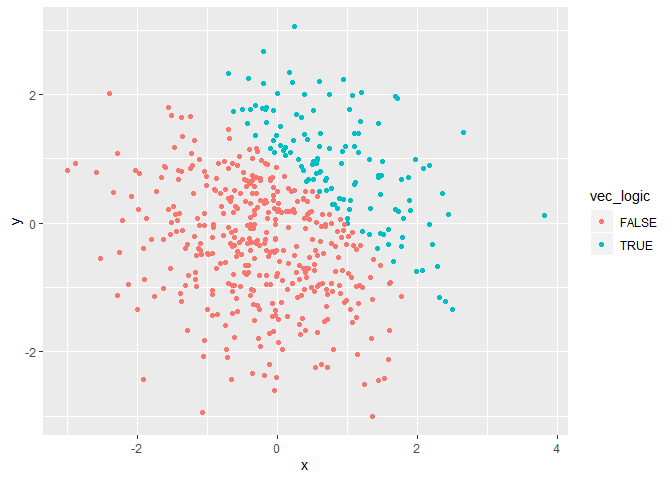
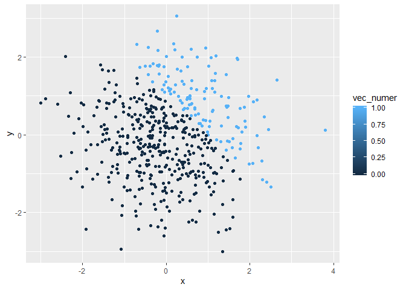
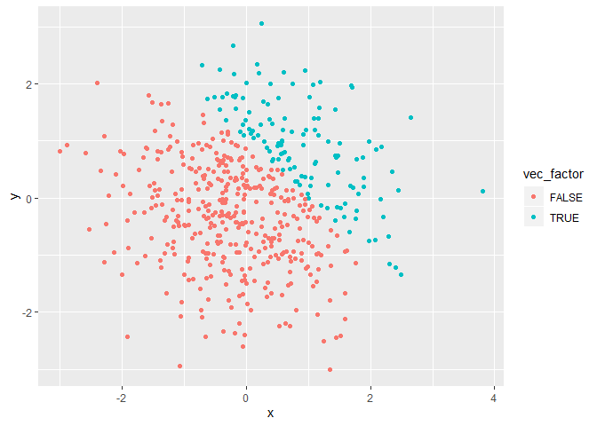

P8105 Homework 1
================
Bingkun Luo
9/14/2019

# Question 1

## a

``` r
library(tidyverse)
```

    ## -- Attaching packages --------------------------------------- tidyverse 1.2.1 --

    ## v ggplot2 3.2.1     v purrr   0.3.2
    ## v tibble  2.1.3     v dplyr   0.8.3
    ## v tidyr   0.8.3     v stringr 1.4.0
    ## v readr   1.3.1     v forcats 0.4.0

    ## -- Conflicts ------------------------------------------ tidyverse_conflicts() --
    ## x dplyr::filter() masks stats::filter()
    ## x dplyr::lag()    masks stats::lag()

``` r
set.seed(1)
df_1 = tibble(samp= rnorm(8),
              vec_logical = samp > 0,
              vec_chara = c("a","a","a","a","a","a","a","a"),
              vec_factor = sample(c("low","medium","high"),8,replace = TRUE)
              )
```

``` r
log = as.numeric(pull(df_1, vec_logical))
log
chara = as.numeric(pull(df_1,  vec_chara))
chara
fac = as.numeric(pull(df_1, vec_factor))  
fac
```

The R compel character and factor variables in to NA, while assign the
logical varible as either 1 or 0. \* The mean of the sample is
0.1314544. \* The mean of the logical vector is 0.625. \* The mean of
the character vector is NA, showing that the mean function does not work
for the character vector. \* The mean of the factor vector is NA,,
showing that the mean function does not work for the factor vector
either.

## b

``` r
convert_1 = as.numeric(pull(df_1, vec_logical))
convert_1*(pull(df_1, samp))
```

    ## [1] 0.0000000 0.1836433 0.0000000 1.5952808 0.3295078 0.0000000 0.4874291
    ## [8] 0.7383247

``` r
convert_2 = as.factor(pull(df_1, vec_logical))
convert_2*(pull(df_1, samp))
```

    ## Warning in Ops.factor(convert_2, (pull(df_1, samp))): '*' not meaningful
    ## for factors

    ## [1] NA NA NA NA NA NA NA NA

``` r
convert_3 = as.numeric(convert_2)
convert_3*(pull(df_1, samp))
```

    ## [1] -0.6264538  0.3672866 -0.8356286  3.1905616  0.6590155 -0.8204684
    ## [7]  0.9748581  1.4766494

# Question 2

## a

``` r
x = rnorm(500)
y = rnorm(500)
vec_logic = (x+y)>1

df_2 = tibble(x,y,vec_logic,
              vec_numer = as.numeric(vec_logic),
              vec_factor = as.factor(vec_logic)
)
```

  - the size of the dataset 500\*5.
  - the mean of x is 0.0085018, median of x is -0.0448214, and standard
    deviation of x is1.0207463.
  - the proportion of cases for which x + y \> 1 is 0.25.

## b

``` r
set.seed(1)

ggplot(df_2, aes(x = x, y = y, color = vec_logic)) + geom_point()
```

<!-- -->

``` r
ggsave("df_2.png", width = 4, height = 4)
```

``` r
ggplot(df_2, aes(x = x, y = y,color = vec_numer)) + geom_point()
```

<!-- -->

``` r
ggplot(df_2, aes(x = x, y = y,color = vec_factor)) + geom_point()
```

<!-- -->

The three graphs showed that the factor and the logical used same
varible to identify data points. Otherwise, the numeric data has showed
different index for the data and more subdivisive structure for
non-integer data.
